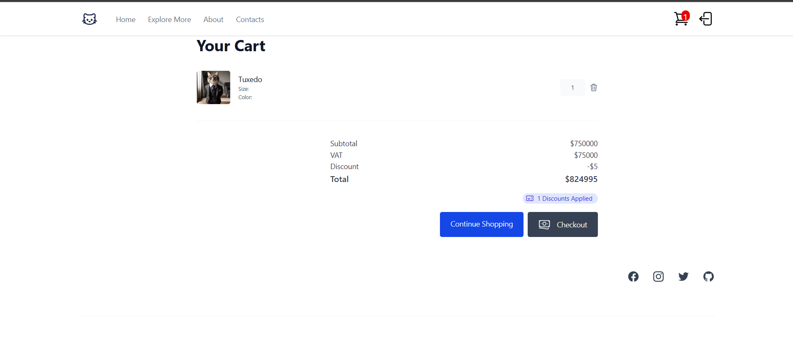
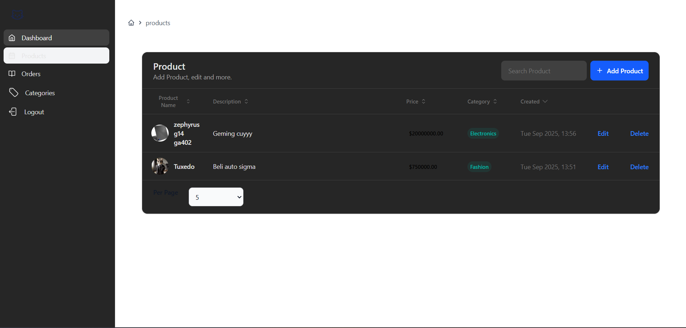
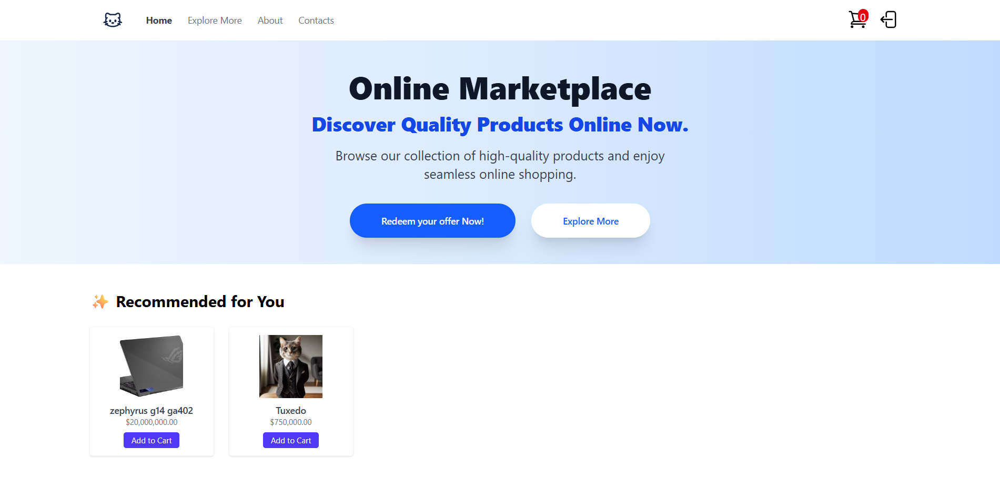

# 🛒 Minimal E-commerce App (Laravel 11 + Livewire)

Proyek ini adalah aplikasi e-commerce sederhana berbasis **Laravel 11**, **Livewire**, dan **TailwindCSS**.  
Tujuannya untuk menyediakan alur dasar belanja online: produk, keranjang belanja, transaksi, dan rekomendasi produk berbasis AI sederhana.

---

## 🚀 Features

- ✅ **Authentication** (DevDojo)
- ✅ **Product Catalog** dengan kategori
- ✅ **Shopping Cart** (add, update, delete)
- ✅ **Transactions** & Transaction Items
- ✅ **AI-like Product Recommendation** (berdasarkan aktivitas pengguna)
- ✅ **Seeder** untuk mengisi produk & kategori otomatis
- ✅ **Livewire Components**:
  - `Header`, `HeroSection`, `ProductSection`, `Footer`
  - `ShoppingCartComponent`
  - `TransactionsPage`
  - `AiProductRecommendation`

---

## 📂 Project Structure

```
app/
 ├── Models/
 │   ├── Category.php
 │   ├── Product.php
 │   ├── Transaction.php
 │   ├── TransactionItem.php
 │   └── ShoppingCart.php
 ├── Livewire/
 │   ├── ShoppingCartComponent.php
 │   ├── TransactionsPage.php
 │   ├── AiProductRecommendation.php
 │   └── ...
database/
 ├── migrations/
 └── seeders/
     ├── CategorySeeder.php
     ├── ProductSeeder.php
     └── DatabaseSeeder.php
resources/
 ├── views/
 │   ├── livewire/
 │   │   ├── shopping-cart-component.blade.php
 │   │   ├── transactions-page.blade.php
 │   │   ├── ai-product-recommendation.blade.php
 │   │   └── ...
 │   └── welcome.blade.php
routes/
 └── web.php
```

---

## ⚙️ Installation

### 1️⃣ Clone & Install Dependencies
```sh
git clone https://github.com/rahsyabenova/ecommerceAsliItu.git
cd ecommerceAsliItu
composer install
npm install && npm run dev
```

### 2️⃣ Setup Environment
```sh
cp .env.example .env
php artisan key:generate
```

Atur koneksi database di file `.env`:

```env
DB_CONNECTION=mysql
DB_HOST=127.0.0.1
DB_PORT=3306
DB_DATABASE=ecommerce
DB_USERNAME=root
DB_PASSWORD=
```

### 3️⃣ Migrate & Seed Database
```sh
php artisan migrate:fresh --seed
```

Seeder akan otomatis mengisi:
- 7 kategori default

### 4️⃣ Jalankan Aplikasi
```sh
php artisan serve
```

Akses: [http://localhost:8000](http://localhost:8000)

---

### Menjalankan Seeder Manual
```sh
php artisan db:seed --class=ProductSeeder
```

---

## 🤖 AI Product Recommendation

Komponen `AiProductRecommendation` bekerja dengan logika sederhana:
- Jika user login:
  - Ambil produk terakhir yang pernah dibeli
  - Rekomendasikan produk dari kategori yang sama
- Jika guest:
  - Rekomendasi acak

Tambahkan di `welcome.blade.php`:
```blade
<livewire:ai-product-recommendation />
```

---

## 📸 Screenshots (contoh)

- **Homepage** dengan daftar produk  


- **Shopping Cart** dengan subtotal, VAT, discount, total  


- **Admin Page** panel admin untuk edit produk dan kategori
  

- **AI Recommendations** menampilkan produk relevan
  

---

created using Laravel 11 + Livewire + TailwindCSS
